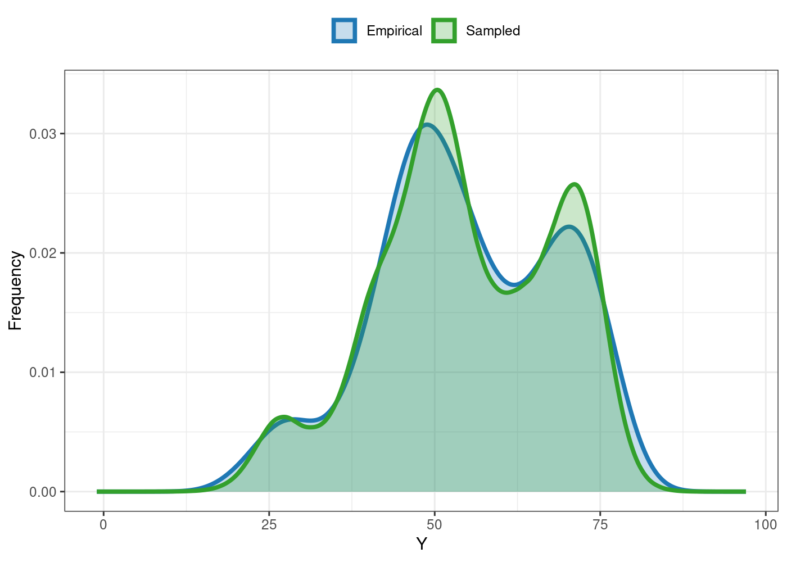
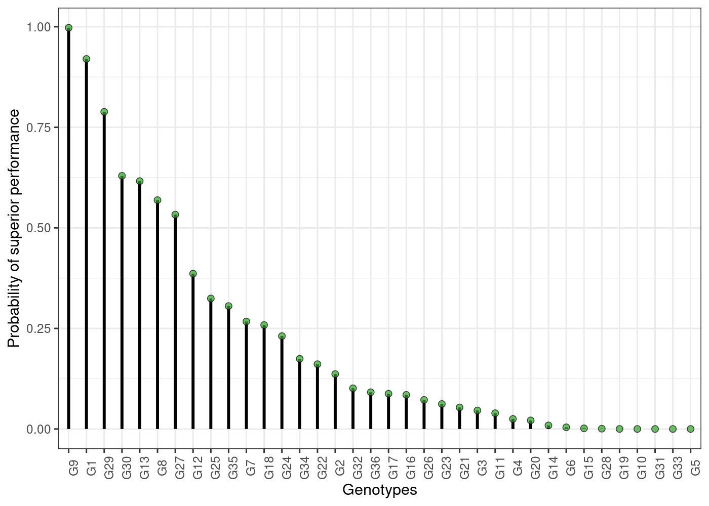
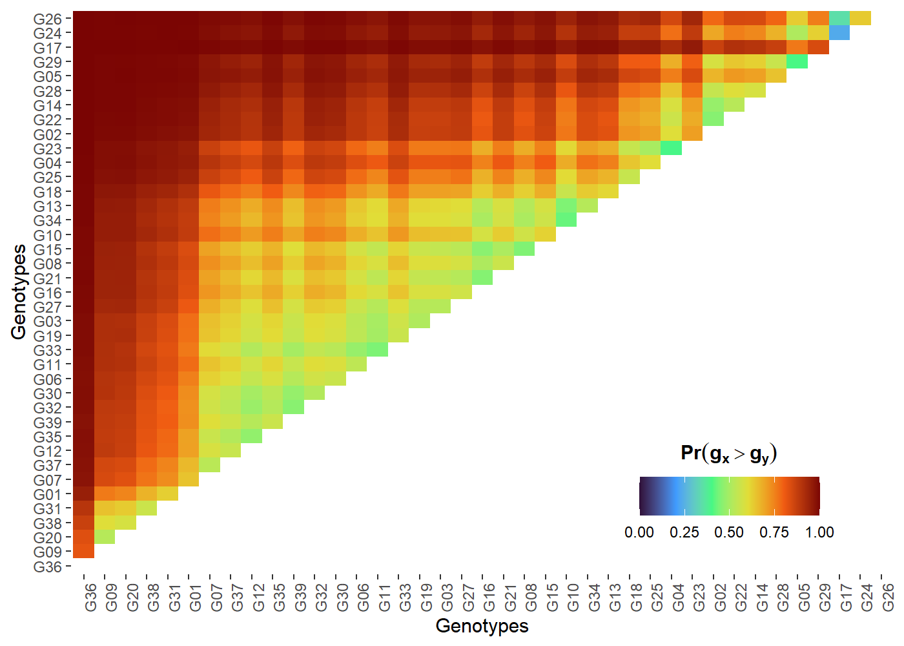
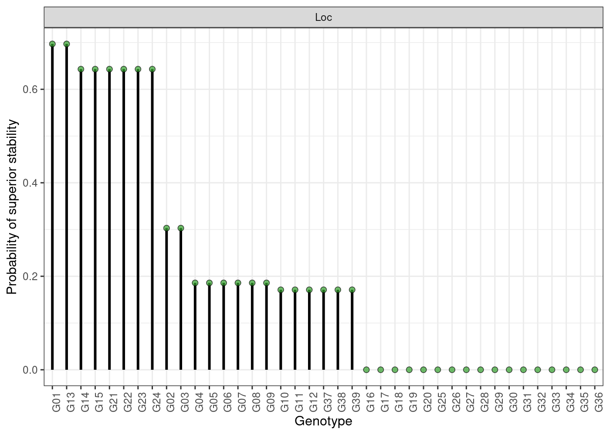
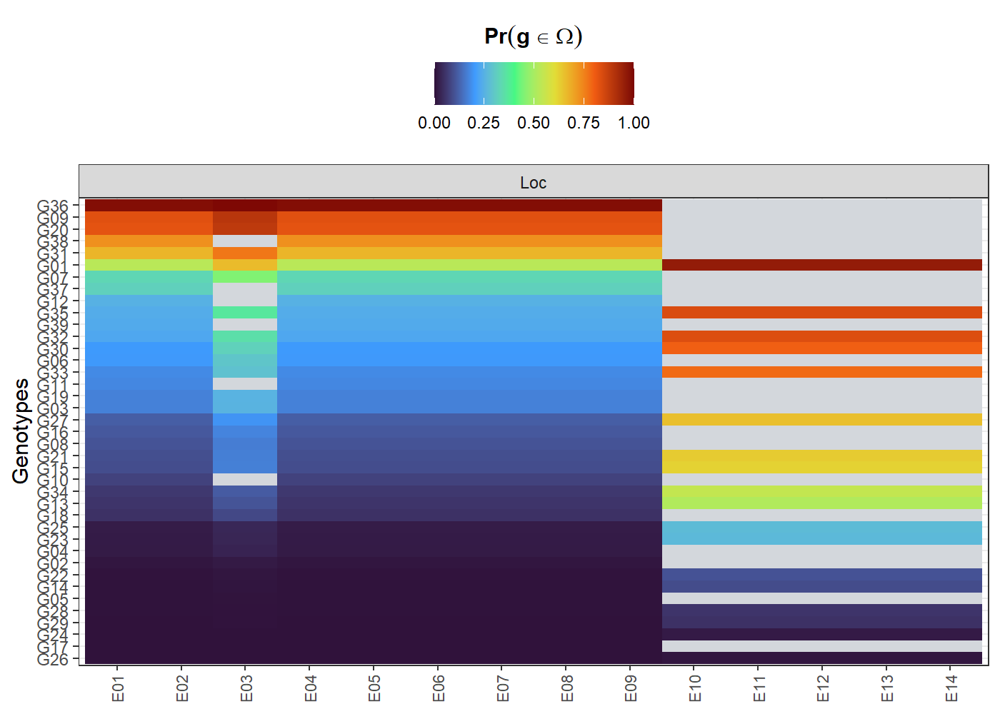

<!-- README.md is generated from README.Rmd. Please edit that file -->

# ProbBreed

<!-- badges: start -->

[](https://lifecycle.r-lib.org/articles/stages.html#stable)
[](https://github.com/saulo-chaves/ProbBreed/actions/workflows/check-release.yaml)
[](https://CRAN.R-project.org/package=ProbBreed)
[](https://saulo-chaves.r-universe.dev/ProbBreed)
[](https://cran.r-project.org/package=ProbBreed)
<!-- badges: end -->

ProbBreed employs Bayesian statistics to analyse multi-environment
trials’ data, and uses its outputs to estimate the marginal and pairwise
probabilities of superior performance and superior stability of the
genotypes, as well as their conditional probability of superior
performance. The method is thoroughly described at
<https://doi.org/10.1007/s00122-022-04041-y>.

## Installation

You can install the CRAN version of `ProbBreed` using the following
command:

``` r
install.packages("ProbBreed")
```

Alternatively, you can install the development version of `ProbBreed`
from [GitHub](https://github.com/saulo-chaves/ProbBreed) with:

``` r
# install.packages("devtools")
devtools::install_github("saulo-chaves/ProbBreed")
```

## Usage

``` r
library(ProbBreed)
```

Currently, `ProbBreed` has nine available models implemented in the
`bayes_met` function. See `?bayes_met` for more details. An examples
using the `soy` example dataset is described below:

``` r
model = bayes_met(data = soy,
                gen = "Gen",
                loc = "Loc",
                repl = NULL,
                year = NULL,
                reg = NULL,
                res.het = TRUE,
                trait = 'Y',
                iter = 6000, cores = 4, chains = 4)
```

`gen`, `loc`, `repl`, `year` and `reg` are all column names that contain
information on genotypes, environments (locations), replicates, years
(or seasons) and regions (or mega-environments). The `soy` dataset has
only adjusted means, so only `gen` and `loc` have values. `res.het`
indicates if a per-environmental residual variance should be estimated.
`trait` is the column in `data` that contain the phenotypic
observations. The other arguments are specifications for model fitting:
the number of iterations, cores and chains. Feel free to customize these
and other options according to your necessity.

The output of this function will be an object of class `stanfit`, which
should be used in the `extr_outs` function for further processing before
computing the probabilities per se. This function also provides some
useful diagnostics. Here is how to use it:

``` r
outs = extr_outs(model = model,
                 probs = c(0.05, 0.95),
                 verbose = TRUE)
```

The object of class `extr` provided by this function contains the
effects’ posterior and maximum posterior, the models’ variance
components and some posterior predictive checks. Here are them:

``` r
outs$variances
#>         effect     var      sd naive.se HPD_0.05 HPD_0.95
#> 1          Gen   3.396   1.299    0.012    1.641    5.785
#> 2          Loc 248.539 127.507    1.164  115.950  481.170
#> 3   error_env1  10.029   2.728    0.025    6.363   14.965
#> 4   error_env2  28.849   7.225    0.066   18.944   42.313
#> 5   error_env3  11.657   3.424    0.031    7.222   18.003
#> 6   error_env4  18.542   4.805    0.044   12.119   27.472
#> 7   error_env5  51.517  12.889    0.118   34.229   74.745
#> 8   error_env6  15.476   4.034    0.037   10.080   23.001
#> 9   error_env7  19.270   4.841    0.044   12.608   28.188
#> 10  error_env8  21.256   5.437    0.050   13.962   31.129
#> 11  error_env9  14.802   3.832    0.035    9.678   21.811
#> 12 error_env10  13.496   5.583    0.051    6.887   23.748
#> 13 error_env11  21.969   8.980    0.082   11.698   37.850
#> 14 error_env12   7.749   3.433    0.031    3.712   14.234
#> 15 error_env13  14.443   5.877    0.054    7.553   25.375
#> 16 error_env14  10.795   4.452    0.041    5.597   19.389
outs$ppcheck
#>                   Diagnostics
#> p.val_max              0.9178
#> p.val_min              0.3604
#> p.val_median           0.7216
#> p.val_mean             0.5008
#> p.val_sd               0.5567
#> Eff_No_parameters     27.5075
#> WAIC2               2715.4563
#> mean_Rhat              1.0003
#> Eff_sample_size        0.6675
```

You can also the `plot` S3 method for some useful visualizations. For
e.g., the comparison between the empirical and sampled phenotype
illustrates the model’s convergence:

``` r
plot(outs)
```



See `?plot.extr` for more details and further options.

After these two steps, everything is set to compute the probabilities.
This can be done using the function `prob_sup`:

A basic workflow using the available data is:

``` r
results = prob_sup(extr = outs, 
                   int = .2,
                   increase = TRUE, 
                   save.df = FALSE, 
                   verbose = TRUE)
```

This function generates an object of class `probsup`, which contains two
lists: `across` and `within`. As their names suggest, the `across` list
has the across-environments probabilities, and is suitable for a broader
recommendation. Conversely, the `within` results are more appropriate to
specific recommendations. For example, here are some probability of
superior performances across and within environments:

``` r
head(results$across$perfo)
#>     ID      prob
#> 36 G36 0.9825833
#> 9  G09 0.8340833
#> 20 G20 0.8162500
#> 38 G38 0.7317500
#> 31 G31 0.6750000
#> 1  G01 0.5250833
head(results$within$perfo$gl)
#>   gen         E01         E02         E03         E04         E05         E06
#> 1 G01 0.525083333 0.525083333 0.666333333 0.525083333 0.525083333 0.525083333
#> 2 G02 0.007833333 0.007833333 0.016333333 0.007833333 0.007833333 0.007833333
#> 3 G03 0.163333333 0.163333333 0.248666667 0.163333333 0.163333333 0.163333333
#> 4 G04 0.013750000 0.013750000 0.027000000 0.013750000 0.013750000 0.013750000
#> 5 G05 0.001083333 0.001083333 0.002583333 0.001083333 0.001083333 0.001083333
#> 6 G06 0.194500000 0.194500000 0.286833333 0.194500000 0.194500000 0.194500000
#>           E07         E08         E09       E10       E11       E12       E13
#> 1 0.525083333 0.525083333 0.525083333 0.9579167 0.9579167 0.9579167 0.9579167
#> 2 0.007833333 0.007833333 0.007833333        NA        NA        NA        NA
#> 3 0.163333333 0.163333333 0.163333333        NA        NA        NA        NA
#> 4 0.013750000 0.013750000 0.013750000        NA        NA        NA        NA
#> 5 0.001083333 0.001083333 0.001083333        NA        NA        NA        NA
#> 6 0.194500000 0.194500000 0.194500000        NA        NA        NA        NA
#>         E14
#> 1 0.9579167
#> 2        NA
#> 3        NA
#> 4        NA
#> 5        NA
#> 6        NA
```

The S3 method `plot` is also available for `probsup` objects. Here are
some of them:

- Probability of superior performance across environments

``` r
plot(results)
```



- Pairwise probability of superior performance across environments

``` r
plot(results, category = "pair_perfo", level = "across")
```



- Probability of superior stability

``` r
plot(results, category = "stabi")
```



- Probability of superior performance within environments

``` r
plot(results, category = "perfo", level = "within")
```



The grey cells are environments where a given genotype was not assessed.
See more options at `?plot.probsup`.

The estimation of these probabilities are strictly related to some key
questions that constantly arises in plant breeding, like:

- **What is the risk of recommending a selection candidate for a target
  population of environments?**

- **What is the probability of a given selection candidate having good
  performance if recommended to a target population of environments? And
  for a specific environment?**

- **What is the probability of a given selection candidate having better
  performance than a cultivar check in the target population of
  environments? And in specific environments?**

- **How probable is it that a given selection candidate performs
  similarly across environments?**

- **What are the chances that a given selection candidate is more stable
  than a cultivar check in the target population of environments?**

- **What is the probability that a given selection candidate having a
  superior and invariable performance across environments?**

For a more detailed tutorial, see
<https://saulo-chaves.github.io/ProbBreed_site/>.

## Citation

Thank you for using `ProbBreed`! Please, do not forget to cite:

``` r
citation('ProbBreed')
```
