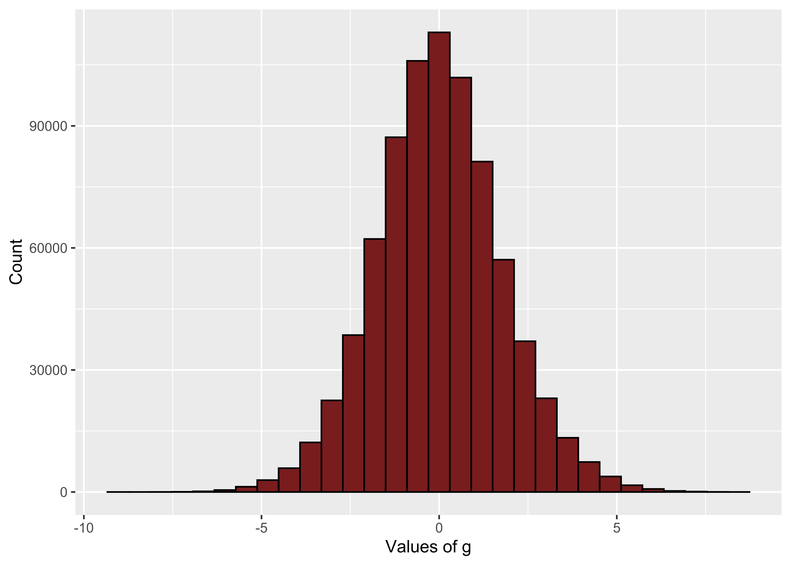
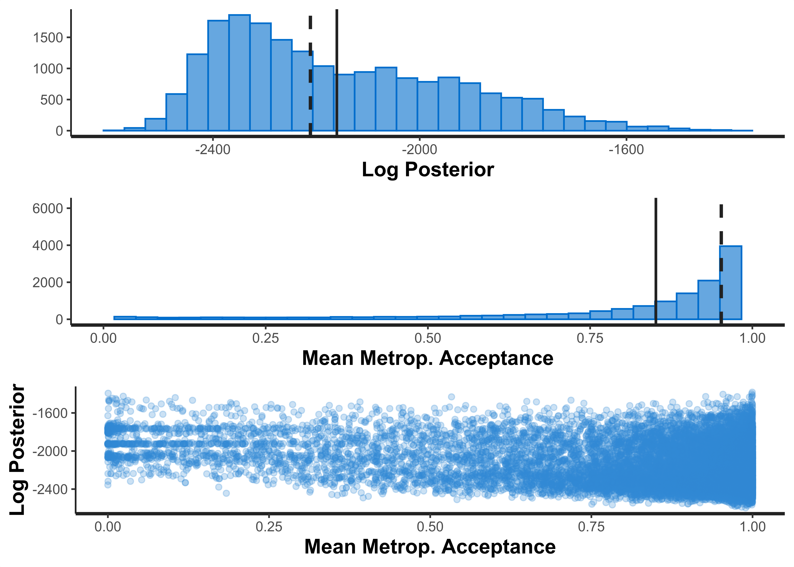
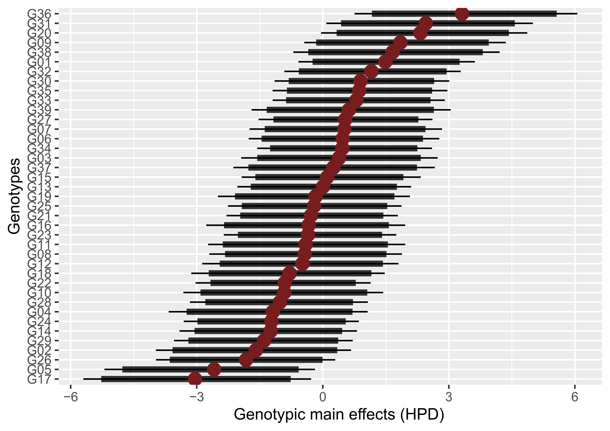
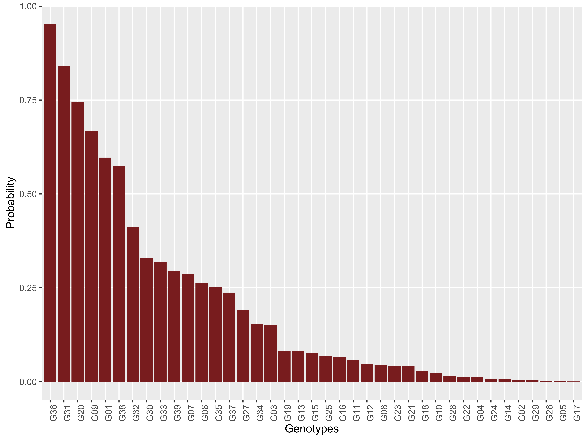
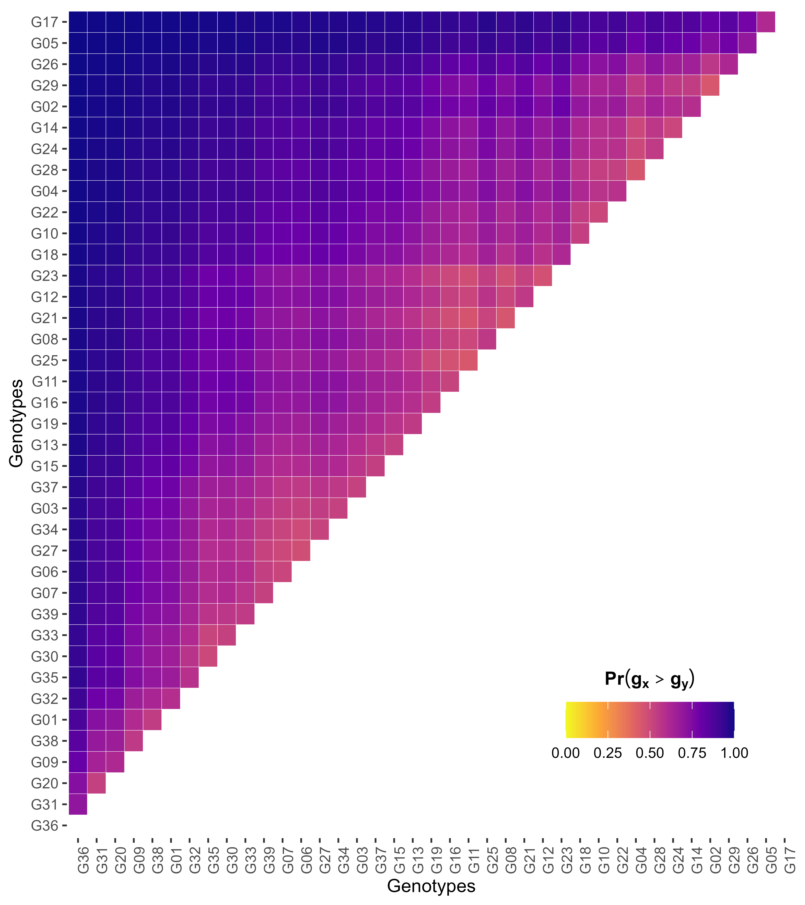
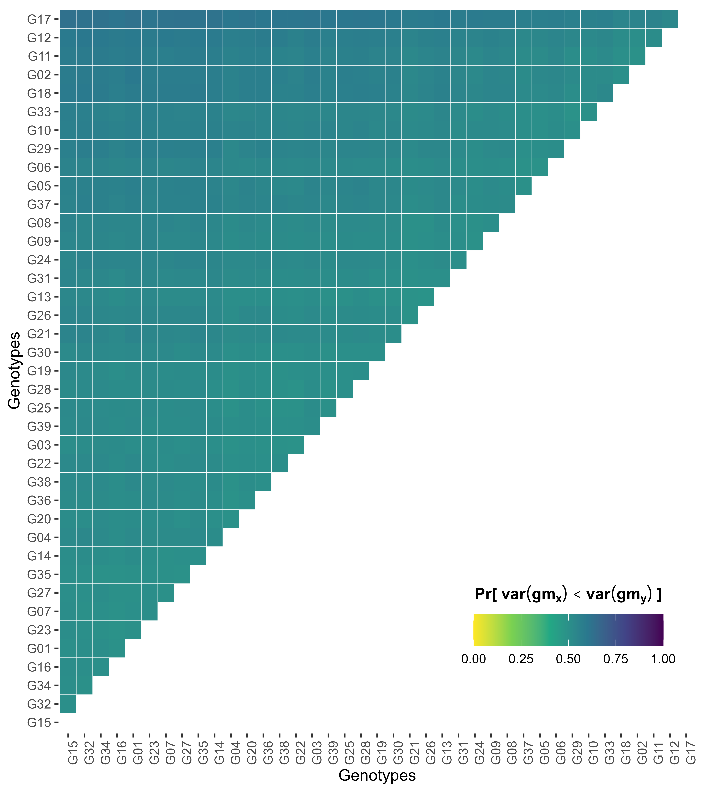
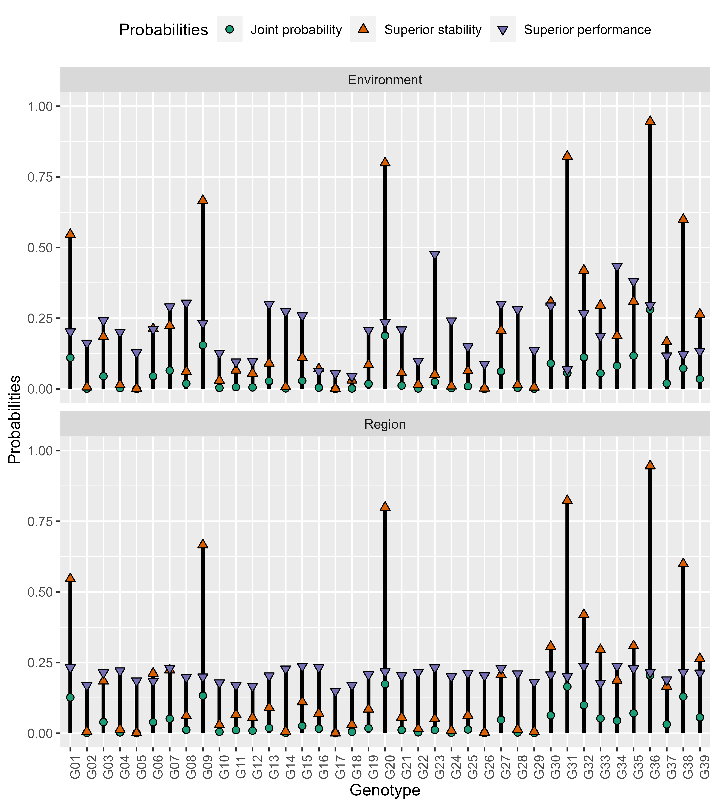
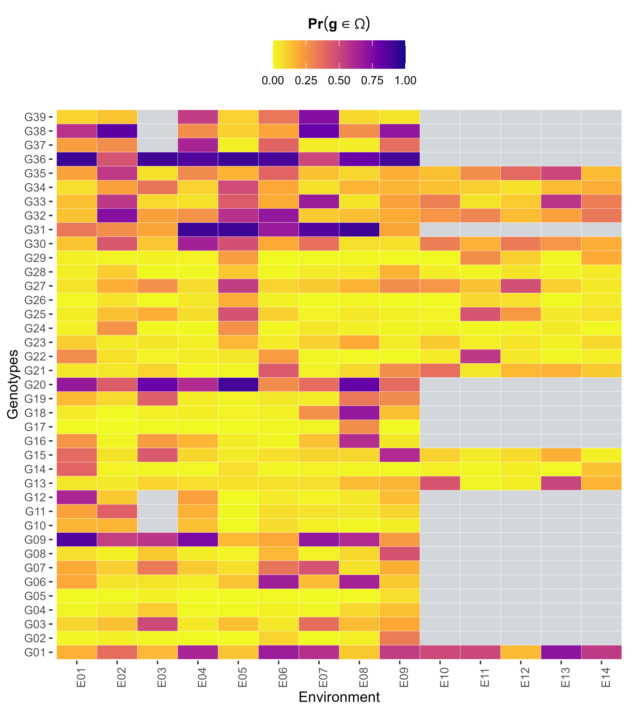
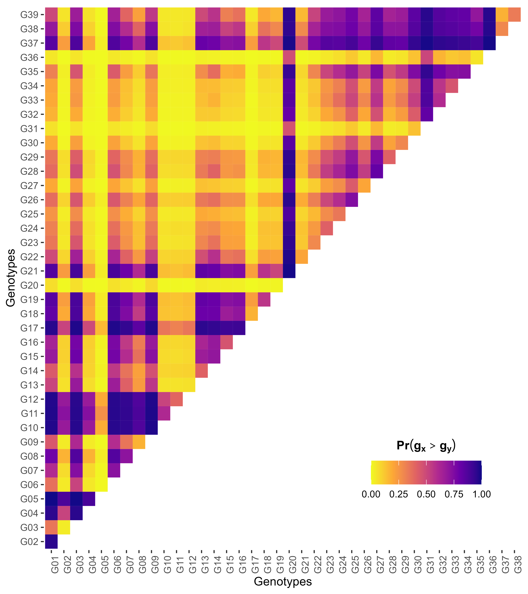

```{r, include = FALSE}
knitr::opts_chunk$set(
  collapse = TRUE,
  comment = "#>"
)
options(rmarkdown.html_vignette.check_title = FALSE)
```


## Introduction

Welcome to ProbBreed. This guide will help you fitting the Bayesian model, extracting the outputs and estimating the probabilities of superior performance, which are used to build the plots. Feel free to contact us if there are any issues. Further details are found within each function documentation (e.g., `?bayes_met`) and in the seminal paper by [Dias et al. (2022)](https://doi.org/10.1007/s00122-022-04041-y).

## Step one

The first step is to load the `ProbBreed` package:

```{r}
library(ProbBreed)
```

## Step two - `bayes_met`

The second step is to fit a multi-environment Bayesian model using the `bayes_met` function. This function has a set of predefined models that are used to run Bayesian analyses using `rstan`, the `R` interface to `Stan`. There are some important details that we would like to stress here:

**1**-    Currently, the function has six options of models: three models are suitable for considering both information of local and region (or mega-environment, or any other factor of higher-level), and the other three models consider only the information of local (or any factor that you consider an environment). The difference between these models is the experimental design they are considering: complete block design (CBD), incomplete block design (IBD), or no design whatsoever (only-means). After choosing the model that fits your situation, you must declare the arguments in the function accordingly (See the figure below):

{width=100%}

In other words, you have the control of which predefined model you will use. All you have to do is correctly declare the arguments `reg` and `repl`, since `gen` and `env` will be always present. Note that if you desire to analyse a data in IBD, `repl` must be a vector of size two (i.e., two strings compiled with `c()`).

**2**-    You may  change the number of iterations, chains and cores. This will vary according to the data and the capacity of your machine. The default is 2000 iterations (including warmup), 1 core and 4 chains. Be aware that the more iterations and chains, the more time the function will take to provide the results. At the same time, the higher is the probability of the model to reach more reliable results. The number of cores depends on the processing capacity of your machine. Choose wisely.

**3**-    You can choose between a model with homogeneous or heterogeneous residual variances using `res.het = F` and `res.het = T`, respectively. 

Without further ado, let us see how the six models can be fitted using `bayes_met()`. The following models are only for didactic purposes, and will not provide a valid output. 

### Without Region and only means

$$
y_{jk} = \mu + l_k + g_j + gl_{jk} + \varepsilon_{jk} 
$$

where the $y_{jk}$ is the phenotypic record of the $j^{\text{th}}$ genotype in the $k^{\text{th}}$ environment. This observation is influenced by a grand mean ($\mu$), the main effects of the $k^{\text{th}}$ environment ($l_k$) and of the $j^{\text{th}}$ genotype ($g_j$), the interaction between these two effects ($gl_{jk}$), and non-explained effects ($\varepsilon_{jk}$). 

```{r eval=FALSE}
mod = bayes_met(data = MyData, 
          gen = "Genotype", 
          env = "Environment",
          repl = NULL,
          reg = NULL,
          res.het = F,
          trait = "Phenotype",
          iter = 2000, cores = 1, chains = 4)
```

### Without Region and randomized complete blocks design

$$
y_{jkp} = \mu + l_k + b_{p(k)} + g_j + gl_{jk} + \varepsilon_{jkp} 
$$

where the $y_{jkp}$ is the phenotypic record of the $j^{\text{th}}$ genotype, allocated in the $p^{\text{th}}$ block, in the $k^{\text{th}}$ environment. All other effects were previously declared but $b_{p(k)}$, which is the effect of the $p^{\text{th}}$ block in the $k^{\text{th}}$ environment.

```{r eval=FALSE}
mod = bayes_met(data = MyData, 
          gen = "Genotype", 
          env = "Environment",
          repl = "Repetition",
          reg = NULL,
          res.het = F,
          trait = "Phenotype",
          iter = 2000, cores = 1, chains = 4)
```

### Without Region and incomplete blocks design

A lattice, for example: 

$$
y_{jkqp} = \mu + l_k + r_{q(k)} + b_{p(qk)} + g_j + gl_{jk} + \varepsilon_{jkqp} 
$$

where the $y_{jkqp}$ is the phenotypic record of the $j^{\text{th}}$ genotype, allocated in the $p^{\text{th}}$ block of the $q^{\text{th}}$ repetition, in the $k^{\text{th}}$ environment. All other effects were previously declared but $r_{q(k)}$, which is the effect of the $q^{\text{th}}$ repetition in the $k^{\text{th}}$ environment. Note that the indices of $b$ also change. 

```{r eval=FALSE}
mod = bayes_met(data = MyData, 
          gen = "Genotype", 
          env = "Environment",
          repl = c("Repetition", "Block"),
          reg = NULL,
          res.het = F,
          trait = "Phenotype",
          iter = 2000, cores = 1, chains = 4)
```

### With Region and only means

$$
y_{jkt} = \mu + m_t + l_k + g_j + ge_{jk} + gm_{jk} + \varepsilon_{jkt} 
$$

All effects were previously declared but $m_t$ and $gm_{jt}$, which is the main effect of region and genotype-by-region interaction effect, respectively. 

```{r eval=FALSE}
mod = bayes_met(data = MyData, 
          gen = "Genotype", 
          env = "Environment",
          repl = NULL,
          res.het = F,
          reg = "Region",
          trait = "Phenotype",
          iter = 2000, cores = 1, chains = 4)
```

### With Region and randomized complete blocks design

$$
y_{jktp} = \mu + m_t + l_k + b_{p(k)} + g_j + gl_{jk} + gm_{jt} + \varepsilon_{jktp} 
$$


```{r eval=FALSE}
mod = bayes_met(data = MyData, 
          gen = "Genotype", 
          env = "Environment",
          repl = "Repetition",
          reg = "Region",
          res.het = F,
          trait = "Phenotype",
          iter = 2000, cores = 1, chains = 4)
```

### With Region and incomplete blocks design

$$
y_{jktqp} = \mu + m_t + l_k + r_{q(k)} + b_{p(qk)} + g_j + gl_{jk} + gm_{jt} + \varepsilon_{jktqp} 
$$

```{r eval=FALSE}
mod = bayes_met(data = MyData, 
          gen = "Genotype", 
          env = "Environment",
          repl = c("Repetition", "Block"),
          reg = "Region",
          res.het = F,
          trait = "Phenotype",
          iter = 2000, cores = 1, chains = 4) 
```

For the next steps, we will use the "soy" data, which is contained within the package. This data set has the adjusted means of 39 genotypes that were evaluated at 14 environments, in 3 breeding regions. 

```{r echo=FALSE}
head(soy)
```

Note that we do not have experimental design in this case, so the correct model has `repl = NULL`

```{r echo=TRUE, warning=FALSE, message=FALSE, eval=FALSE}
mod = bayes_met(data = soy,
                gen = "Gen",
                env = "Env",
                repl = NULL,
                reg = "Reg",
                res.het = F,
                trait = "Y",
                iter = 10000, cores = 4, chains = 4)
```

```{r echo=FALSE}
load('tes.RData')
load('marginal.RData')
load('conditional.RData')
```

## Step three - `extr_outs`

After fitting the model, the next step is to extract some useful outputs. The `extr_outs()` function is a pre-requisite for estimating the probability of superior performance using the other functions. `extr_outs()` also provides some important diagnostics regarding the convergence and reliability of the model. 

Using the `mod` object from the previous step:
```{r echo=TRUE, warning=FALSE, results='hide', fig.width=8, eval=FALSE}
outs = extr_outs(data = soy, trait = 'Y', gen = 'Gen', model = mod,
                 effects = c('l','g','gl','m','gm'),
                 nenv = length(unique(soy$Env)),
                 res.het = F, 
                 probs = c(0.05, 0.95), check.stan.diag = F)
```

In this function structure: 

* `model` is the model fitted using `bayes_met`

* `effects` indicates which effects `model` has. Here, you may provide a string vector with the codes for each possible effect. The codes are:

  * `r` : replicate effect

  * `b` : block effect

  * `l` : environment (or location) effect

  * `m` : region effect

  * `g` : genetic effect

  * `gl` : genotype-by-location effect

  * `gm` : genotype-by-region effect

The models will surely have `r`, `l`, `g` and `gl`. The other effects may or may not be necessary, depending on the situation.

* `nenv` indicates the number of environments

* `probs` are the probabilities that the function will consider to calculate the quantiles and the HPD (please, provide values between 0 and 1)

* `check.stan.diag` asks whether you want diagnostic plots provided by `rstan::stan_diag()` or not.

The function provides a list with the posterior of each effect, the data generated by the model, a data frame with the variances of each effect, a list with the maximum posterior values of each effect, and a matrix containing some useful quality parameters of the model (See below):

```{r echo=TRUE, eval=FALSE}
outs$variances
```

```{r echo=FALSE}
var_pp[[1]]
```

```{r echo=TRUE, eval=FALSE}
outs$ppcheck
```

```{r echo=FALSE}
var_pp[[2]]
```

It also provides a list containing built-in histograms, density plots and trace plots of each effect. For example, the density plot comparing the generated data by each chain and the real data...

```{r echo=TRUE, fig.retina=2, fig.width=6, fig.height=6, eval=FALSE}
outs$fun_plots$densities$sampled_y
```

{width=100%}

...Or the histogram of the genetic main effects:

```{r echo=TRUE, fig.retina=2, fig.width=6, fig.height=6, eval=FALSE}
outs$fun_plots$histogram$g
```
{width=100%}

These plots are available for all effects declared in `extr_outs()`. Feel free to explore it. 
As an option, the function also provides some diagnostic plots of `rstan::stan_diag()`. The `...` is passed to `rstan::stan_diag()`, so you can explore further options provided by the function. For more information about these plots, please refer to `?rstan::stan_diag`.

```{r echo=TRUE, warning=FALSE, results='hide',fig.width=6, fig.height=6, eval=FALSE}
outs = extr_outs(data = soy, trait = 'Y', gen = 'Gen', model = mod,
                 effects = c('l','g','gl','m','gm'),
                 nenv = length(unique(soy$Env)),
                 res.het = F, check.stan.diag = T)

```


{width=100%}


## Step four - `prob_sup`

Using the outputs extracted by `extr_outs()`, we can finally calculate the probability of superior performance and superior stability of the evaluated genotypes. This is exactly what `prob_sup()` will do:

```{r echo=TRUE, eval=FALSE}
results = prob_sup(data = soy, trait = "Y", gen = "Gen", env = "Env",
                   extr_outs = outs, reg = 'Reg', int = .2,
                   increase = T, save.df = F, interactive = F)
```

`data`, `trait`, `gen`, `env` and `reg` were previously described. The new commands of this function are:

*   `increase`: The selection is for increasing (`TRUE`, default) or decreasing (`FALSE`) the trait mean? 

*   `extr_outs`: An object that contains the outputs extracted by `extr_outs()`.

*   `int`: The selection intensity, expressed in decimal values.

*   `save.df`: `TRUE` if you want to save the data frames containing the calculated probabilities in the work directory, `FALSE` otherwise.

*   `interactive`: `TRUE` if you want to convert the ggplots into ggplotlys, i.e. make them interactive plots, `FALSE` otherwise.

The outputs of this function are divided into two lists: `marginal` and `conditional`. The first list contains the probabilities of superior performance and superior stability across environments, whilst the second contains the probabilities of superior performance within environments. Both lists have the pairwise probabilities of both superior performance and stability, for comparison purposes. 

### Marginal output

The `marginal` list contains two other lists: one with data frames detailing the results of each computed probability, and another with ggplots illustrating the computed probabilities. Below, we detail each result:

#### High posterior density of genetic main effects

This metric is illustrated in a caterpillar plot: 

```{r echo=TRUE, eval=FALSE}
results$marginal$plots$g_hpd
```

{width=100%}

#### Probability of superior performance

Let $\Omega$ represent the subset of selected genotypes based on their performance across environments. A given genotype $j$ will belong to $\Omega$ if its genetic marginal value ($g_j$) is among the top $V$, with $V$ being the selection intensity. `prob_sup()` leverages the Monte Carlo discretized sampling from the posterior distribution to emulate the occurrence of $S$ trials. Thence, the probability of the $j^{\text{th}}$ genotype belonging to $\Omega$ is the ratio of success ($g_j \in \Omega$) and the total number of sampled events (the emulated $S$ trials):

$$
Pr(g_j \in \Omega \vert y) = \frac{1}{S}\sum_{s=1}^S{I(g_j^{(s)} \in \Omega \vert y)}
$$
where $S$ is the total number of samples ($s = 1, 2, \dots, S$), and $I(g_j^{(s)} \in \Omega \vert y)$ is an indicator variable mapping success (1) if $g_j^{(s)}$ exists in $\Omega$ in the $s^{\text{th}}$ sample, and failure (0) otherwise. $S$ is conditioned to the number of iterations and chains previously set at `bayes_met()`. 

The results provided by `prob_sup()` can be accessed using the following commands: 

```{r echo=TRUE,fig.width=6, fig.height=6, eval=FALSE}
head(results$marginal$df$perfo)
```

```{r echo=FALSE}
head(marginal$perfo)
```

```{r, eval=FALSE}
results$marginal$plots$perfo
```

{width=100%}

#### Pairwise probability of superior performance

To directly compare a selection candidate with a commercial check, or another promising genotype, we can calculate the pairwise probability of superior performance. This metric computes the probability of a genotype $j$ performing better than a genotype $i$:

$$
Pr(g_j > g_i \vert y) = \frac{1}{S}\sum_{s=1}^S{I(g_j^{(s)} > g_i^{(s)} \vert y)}
$$
where $I(g_j^{(s)} > g_i^{(s)} \vert y)$ is an indicator variable mapping if $g_j$ is better (1) than $g_i$, or not (0). Note that this equation is applied if the selection direction is to increase the trait value. If the aim is to decrease it (for example, plant height or the damage of a disease), you can set `increase = F`, and the following equation is employed: 

$$
Pr(g_j < g_i \vert y) = \frac{1}{S}\sum_{s=1}^S{I(g_j^{(s)} < g_i^{(s)} \vert y)}
$$
The results are accessed using the following commands:

```{r echo=TRUE,fig.width=6, fig.height=6, eval=FALSE}
head(results$marginal$df$pair_perfo)
```

```{r echo=FALSE}
head(marginal$pair_perfo)
```

```{r, eval=FALSE}
results$marginal$plots$pair_perfo
```

{width=100%}

The results indicates the probability of genotypes at the _x_-axis performing superiorly in relation to those at the _y_-axis.

#### Probability of superior stability

Another criterion for recommending candidates to a target population of environments is by assessing how variable is their performance across environments. If we consider genotypes that have low genotype-by-environment interaction variance [$var(ge_{jk})$] as stable, the probability of superior stability is given by the following equation: 

$$
Pr[var(ge_{jk}) \in \Omega \vert y] = \frac{1}{S} \sum_{s=1}^S{I[var(ge_{jk}) \in \Omega \vert y]}
$$
where $I[var(ge_{jk}) \in \Omega \vert y]$ is an indicator variable mapping success (1) if the $j^{\text {th}}$ has one of the $V$ lower variances of the genotype-by-environment interaction, and failure (0) otherwise.

If `reg` is not `NULL`, like in the example, two probabilities are computed separately, one for the genotype-by-environment interaction (`stabi_gl`), and another for the genotype-by-region interaction (`stabi_gm`). Otherwise, if `reg = NULL`, only `stabi_gl` will be available. For the example we are running, the results are accessed using the following commands:

-   Genotype-by-environment interaction

```{r eval=F, echo=TRUE}
head(results$marginal$df$stabi_gl)
```

```{r eval=TRUE, echo=F}
head(marginal$stabi_gl)
```

```{r echo=TRUE, eval=FALSE}
results$marginal$plots$stabi_gl
```

{width=100%}

-   Genotype-by-region interaction

```{r eval=F, echo=TRUE}
head(results$marginal$df$stabi_gm)
```

```{r eval=T, echo=F}
head(marginal$stabi_gm)
```

```{r echo=TRUE, eval=FALSE}
results$marginal$plots$stabi_gm
```

{width=100%}

#### Pairwise probability of superior stability

We can also compare the stability of two selection candidates, or a experimental genotype and a commercial check. The following equation is used: 

$$
Pr[var(ge_{jk}) < var(ge_{ik}) \vert y] = \frac{1}{S} \sum_{s=1}^S{I [var(ge_{jk}^{(s)}) < var(ge_{ik}^{(s)}) \vert y]}
$$
note that, in this case, we are always interested in the genotype that has a lower variance of the genotype-by-environment (or genotype-by-region) interaction effects. 

Again, there will be two different results when `reg` is not `NULL` (see below). When `reg = NULL`, only `pair_stabi_gl` is available. The following commands are used to access the results:


-   Genotype-by-environment interaction

```{r eval=F, echo=TRUE}
head(results$marginal$df$pair_stabi_gl)
```

```{r eval=TRUE, echo=F}
head(marginal$pair_stabi_gl)
```

```{r echo=TRUE, eval=FALSE}
results$marginal$plots$pair_stabi_gl
```

{width=100%}

The results indicates the probability of genotypes at the _x_-axis being more stable than the genotype at the _y_-axis.

-   Genotype-by-region interaction

```{r eval=F, echo=TRUE}
head(results$marginal$df$pair_stabi_gm)
```

```{r eval=T, echo=F}
head(marginal$pair_stabi_gm)
```

```{r echo=TRUE, eval=FALSE}
results$marginal$plots$pair_stabi_gm
```

{width=100%}

The results indicates the probability of genotypes at the _x_-axis being more stable than the genotype at the _y_-axis.

#### Joint probability of superior performance and superior stability

Assuming that these the genetic main effects are independent of the variance of the genotype-by-environment interaction effects, the joint probability of superior performance and superior stability follows the same ideia as the probability of occurrence of two independent events: 

$$
Pr[g_j \in \Omega, var(ge_{jk} \in \Omega)] = Pr(g_j \in \Omega \vert y) \times Pr[var(ge_{jk}) \in \Omega \vert y]
$$

The results are accessed using the following commands:

```{r eval=F, echo=TRUE}
head(results$marginal$df$joint_prob)
```

```{r eval=T, echo=F}
head(marginal$joint_prob)
```

```{r echo=TRUE, eval=FALSE}
results$marginal$plots$joint_prob
```

{width=100%}

If `reg = NULL`, there will be no differentiation between environments and region in the plot above.

### Conditional output

The probabilities of superior performance can be particularized for each environment. In other words, if you want to recommend an experimental genotype for a specific location, for example, these are the results you are looking for. The `conditional` list is also divided into two sublists. The first, `df`, contains the results compiled into data frames. The second, `plots`, have the corresponding ggplots. 

#### Probability of superior performance

It is exactly the same idea as previous stated, but instead of using the marginal genetic effect of each genotype, we use the conditional genetic effect ($g_{jk} = g_j + ge_{jk}$): 

$$
Pr(g_{jk} \in \Omega_k \vert y) = \frac{1}{S}\sum_{s=1}^S{I(g_{jk}^{(s)} \in \Omega_k \vert y)}
$$

The results are accessed using the following commands:

```{r echo=TRUE, eval=FALSE}
head(results$conditional$df$perfo)
```

```{r echo=FALSE, eval=TRUE}
head(conditional$perfo)
```

```{r echo=TRUE, eval=FALSE}
results$conditional$plots$perfo_env
```

{width=100%}
 
 The grey cells are environments in which the genotype specified in the row was not evaluated.
 
```{r echo=TRUE, eval=FALSE}
results$conditional$plots$perfo_reg
```

{width=100%}

This plot is only available if `reg` is not `NULL`.

#### Pairwise probability of superior performance

A directly comparison between genotypes evaluated at the same environment. `prob_sup()` used the following equations: 

-   When `increase = TRUE`

$$
Pr(g_{jk} > g_{ik} \vert y) = \frac{1}{S}\sum_{s=1}^S{I(g_{jk}^{(s)} > g_{ik}^{(s)} \vert y)}
$$

-   When `increase = FALSE`

$$
Pr(g_{jk} < g_{ik} \vert y) = \frac{1}{S}\sum_{s=1}^S{I(g_{jk}^{(s)} < g_{ik}^{(s)} \vert y)}
$$

Note that this result could not be compiled into a single data frame, since there will be a pairwise comparison for each environment. Therefore, we opt to build several data frames and store them in a list (`pair_perfo_env`). When `reg` is not `NULL`, there will also be a second list, `pair_perfo_reg`. The ggplots are also stored in lists. Therefore, the results are accessed using the following commands, taking the environment "E05" and the region "R2" as examples:


```{r echo=TRUE, eval=FALSE}
head(results$conditional$df$pair_perfo_env$E05)
```

```{r echo=FALSE, eval=TRUE}
head(conditional$E05)
```

```{r echo=TRUE, eval=FALSE}
results$conditional$plots$pair_perfo_env$E05
```

{width=100%}


```{r echo=TRUE, eval=FALSE}
head(results$conditional$df$pair_perfo_reg$R2)
```

```{r echo=FALSE, eval=TRUE}
head(conditional$R2)
```

```{r echo=TRUE, eval=FALSE}
results$conditional$plots$pair_perfo_reg$R2
```

{width=100%}

Like the other heat maps, we are evaluating the probability of genotypes at _x_-axis being superior than genotypes at the _y_-axis. 

Note that the estimation of these probabilities are strictly related to some key question that constantly arises in plant breeding: 

-   **What is the risk of recommending a selection candidate for a target population of environments?**

-   **What is the probability of a given selection candidate having good performance if recommended to a target population of environments? And for a specific environment?**
 
-   **What is the probability of a given selection candidate having better performance than a cultivar check in the target population of environments? And in specific environments?**
 
-   **How probable is it that a given selection candidate performs similarly across environments?**

-   **What are the chances that a given selection candidate is more stable than a cultivar check in the target population of environments?**

-   **What is the probability that a given selection candidate having a superior and invariable performance across environments?**

We hope this package is useful for you to answer any of these questions. Feel free to contact us if there any issues or suggestions for improvement. 

<br>

<br>

**FIM**
