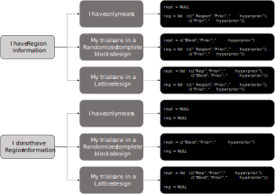

```{r, include = FALSE}
knitr::opts_chunk$set(
  collapse = TRUE,
  comment = "#>"
)
```


## Introduction

Welcome to ProbSup. This guide will help you to fit the Bayesian model, extract the outputs and estimate the probabilities, which are used to build the plots. Feel free to contact us if there are any issues. Further details are found within each function documentation (e.g.: `?bayes_met`) and in the seminal paper by [Dias et al. (2022)](https://doi.org/10.1007/s00122-022-04041-y).

## Step one

Obviously, the first step is to load the `ProbSup` package:

```{r}
library(ProbSup)
```

We know you did not come here for this, so let us go to the next step.

## Step two - `bayes_met`

The second step is to fit a Multi-environment Bayesian model using the `bayes_met` function, using the `rstan` language implemented within it. There are some importantat details that we would like to stress here:

1- The function lets you define which is the prior and hyperprior of each effect of the model. This is controlled by building a vector with the following structure: c("Name of the effect in your data frame", "Desired prior", "Desired hyperprior"). For example, for the genetic and environmental effects:

```{r echo=TRUE}

gen = c("Hybrid", "normal", "cauchy")
env = c("Location", "normal", "cauchy")

```

When you provide the function with these vectors, you are saying that "the column in my data frame that has the information of genotypes is called 'Hybrid', and this effect will have a prior following the normal distribution, and a hyperprior following the half-cauchy distribution". 


2- Currently, the function has six options of models: Three models are suitable for considering both information of local and region, and the other three models consider only the information of local (or any factor that you consider an environment). The difference between these models is the experimental design they are considering: randomized complete block, lattice, or no design whatsoever (only means). After choosing the model that fits your situation, you must build the vectors of region and replicates (and blocks) effects accordingly (See the figure below).

```{r}

```

Note that when you consider the Region information, and when the trials are lattices, you *must* build a list, not a vector.

3- Feel free to change the hyperparameter if you will. The "default" implemented in the function is the maximum value of the trait, multiplied by 10. 

4- You may also change the number of iterations, chains and cores. This will vary according to the data and the capacity of your machine. The default is 4000 iterations, 4 cores and 4 chains. Be aware that the more iterations and chains, the more time the function will take to provide the results. Despite of this drawback, the more iterations, the higher is the probability of the model to reach more reliable results.

Without further ado, let us see how the six models can be fitted using `bayes_met`. We used the "maize" data, which is contained within the package.

### Without Region and only means

```{r eval=FALSE}
mod = bayes_met(data = maize, 
          gen = c("Hybrid", "normal", "cauchy"), 
          env = c("Location", "normal", "cauchy"),
          rept = NULL,
          reg = NULL,
          sigma.dist = c("cauchy", "cauchy"), mu.dist = c("normal", "cauchy"),
          gli.dist = c("normal", "normal"), trait = "GY", hyperparam = "default",
          iter = 4000, cores = 4, chain = 4)
```

### Without Region and randomized complete blocks

```{r eval=FALSE}
mod = bayes_met(data = maize, 
          gen = c("Hybrid", "normal", "cauchy"), 
          env = c("Location", "normal", "cauchy"),
          rept = c("Block", "normal", "cauchy"),
          reg = NULL,
          sigma.dist = c("cauchy", "cauchy"), mu.dist = c("normal", "cauchy"),
          gli.dist = c("normal", "normal"), trait = "GY", hyperparam = "default",
          iter = 4000, cores = 4, chain = 4)
```

### Withou Region and lattice

```{r eval=FALSE}
mod = bayes_met(data = maize, 
          gen = c("Hybrid", "normal", "cauchy"), 
          env = c("Location", "normal", "cauchy"),
          rept = list(c("Rep", "normal", "cauchy"), c("Block", "normal", "cauchy")),
          reg = NULL,
          sigma.dist = c("cauchy", "cauchy"), mu.dist = c("normal", "cauchy"),
          gli.dist = c("normal", "normal"), trait = "GY", hyperparam = "default",
          iter = 4000, cores = 4, chain = 4) 
```

### With Region and only means

```{r eval=FALSE}
mod = bayes_met(data = maize, 
          gen = c("Hybrid", "normal", "cauchy"), 
          env = c("Location", "normal", "cauchy"),
          rept = NULL,
          reg = list(c("Region", "normal", "cauchy"), c("normal", "cauchy")),
          sigma.dist = c("cauchy", "cauchy"), mu.dist = c("normal", "cauchy"),
          gli.dist = c("normal", "normal"), trait = "GY", hyperparam = "default",
          iter = 4000, cores = 4, chain = 4)
```

### With Region and randomized complete blocks

```{r eval=FALSE}
mod = bayes_met(data = maize, 
          gen = c("Hybrid", "normal", "cauchy"), 
          env = c("Location", "normal", "cauchy"),
          rept = c("Block", "normal", "cauchy"),
          reg = list(c("Region", "normal", "cauchy"), c("normal", "cauchy")),
          sigma.dist = c("cauchy", "cauchy"), mu.dist = c("normal", "cauchy"),
          gli.dist = c("normal", "normal"), trait = "GY", hyperparam = "default",
          iter = 4000, cores = 4, chain = 4)
```

### With Region and lattice

```{r eval=FALSE}
mod = bayes_met(data = maize, 
          gen = c("Hybrid", "normal", "cauchy"), 
          env = c("Location", "normal", "cauchy"),
          rept = list(c("Rep", "normal", "cauchy"), c("Block", "normal", "cauchy")),
          reg = list(c("Region", "normal", "cauchy"), c("normal", "cauchy")),
          sigma.dist = c("cauchy", "cauchy"), mu.dist = c("normal", "cauchy"),
          gli.dist = c("normal", "normal"), trait = "GY", hyperparam = "default",
          iter = 4000, cores = 4, chain = 4) 
```

```{r eval=FALSE}
mod = bayes_met(data = maize, 
          gen = c("Hybrid", "normal", "cauchy"), 
          env = c("Location", "normal", "cauchy"),
          rept = list(c("Rep", "normal", "cauchy"), c("Block", "normal", "cauchy")),
          reg = list(c("Region", "normal", "cauchy"), c("normal", "cauchy")),
          sigma.dist = c("cauchy", "cauchy"), mu.dist = c("normal", "cauchy"),
          gli.dist = c("normal", "normal"), trait = "GY", hyperparam = "default",
          iter = 100, cores = 2, chain = 2) 
```


